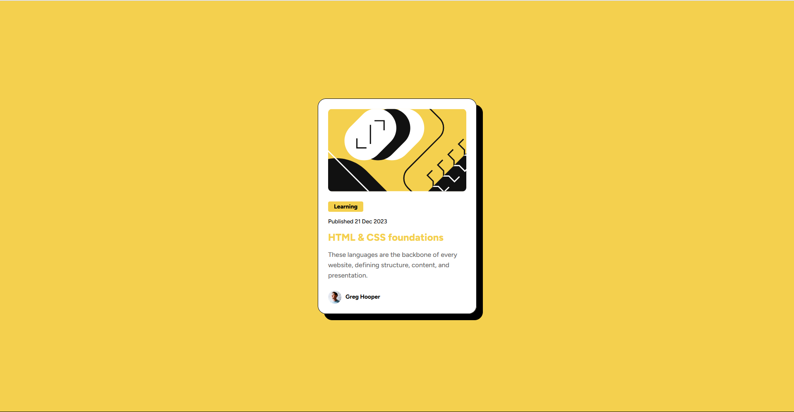

# Frontend Mentor - Blog preview card solution

This is a solution to the [Blog preview card challenge on Frontend Mentor](https://www.frontendmentor.io/challenges/blog-preview-card-ckPaj01IcS). 

## Table of contents

- [Overview](#overview)
  - [The challenge](#the-challenge)
  - [Screenshot](#screenshot)
  - [Links](#links)
- [My process](#my-process)
  - [Built with](#built-with)
  - [What I learned](#what-i-learned)
  - [Continued development](#continued-development)
  - [Useful resources](#useful-resources)
- [Author](#author)
- [Acknowledgments](#acknowledgments)

## Overview
This is a front-end challenge from Front-end Mentor. The task is to build an interactive blog preview card and to make it as similar as possible to the original design.

### The challenge

Users should be able to:

- See hover and focus states for all interactive elements on the page

### Screenshot


.png)

### Links

- Solution URL: [Add solution URL here](https://your-solution-url.com)
- Live Site URL: [Add live site URL here](https://your-live-site-url.com)

## My process
I began by visualizing and structuring the HTML with semantic elements, ensuring a clean and organized layout. I used a <main> tag to wrap the content, and within it, a <section> for the card container. This contained an image, article details, and author information. I styled the card using CSS, focusing on a modern, clean design. I set a responsive layout with a flexbox, ensuring that elements aligned neatly. I implemented hover effects on the card and the title to add interactivity. Media queries were added to ensure the design was responsive, particularly for smaller screens.

### Built with

- Semantic HTML5 markup
- Pure CSS
- Flexbox

### What I learned

I gained a deeper understanding of responsive design principles and the importance of flexibility in layout structures. I learned how to effectively use CSS Flexbox for aligning and distributing space among items within a container, which significantly simplifies responsive design. Additionally, I realized the importance of media queries in making designs adaptable to different screen sizes, ensuring that the user experience remains optimal across all devices

To see how you can add code snippets, see below:

```html
<title>Some HTML code I'm proud of</title>
  <article class="card-content">
    <h5 class="card-tag">Learning</h5>
    <h5 class="date">Published <time datetime="2023-12-21">21 Dec 2023</time></h5>
    <h2>HTML & CSS foundations</h2>
    <p>These languages are the backbone of every website, defining structure, content, and presentation.</p>
  </article>
```
```css
.proud-of-this-css {
  .card-container {
    max-width: 384px;
    background-color: white;
    padding: 24px;
    margin: 0 24px;
    display: flex;
    flex-direction: column;
    gap: 24px;
    border-radius: 20px;
    border: 1px solid black;
    box-shadow: 7px 7px black;
    transition: box-shadow 0.3s;
}

.card-container:hover {
    box-shadow: 15px 15px 0px black;
}
}
```
### Continued development

I would continue practice using flexbox, media queries and using hsl colors in the future. PRACTICE MAKES PERFECT!

### Useful resources

- [CSS Flexbox Tutorial](https://www.youtube.com/watch?v=Y8zMYaD1bz0&list=PL4cUxeGkcC9i3FXJSUfmsNOx8E7u6UuhG) - This helped me for as the channel explained in detail how to use flexbox. I really liked this channel and will use it going forward for tutorials.

## Author

- Github - [@abigbroomstick](https://github.com/abigbroomstick)
- Frontend Mentor - [@abigbroomstick](https://www.frontendmentor.io/profile/abigbroomstick)
- Facebook - [@Nam Nguyen](https://www.facebook.com/nam.nguyenbathanh/)

## Acknowledgments

Ashleynguci- she gave me huge motivation to learn web development :D
Colt Steele- best Udemy Front-End class I've taken so far
Nheo Hi- my lovely girlfriend who puts up with me every time I stayed up late to code.
